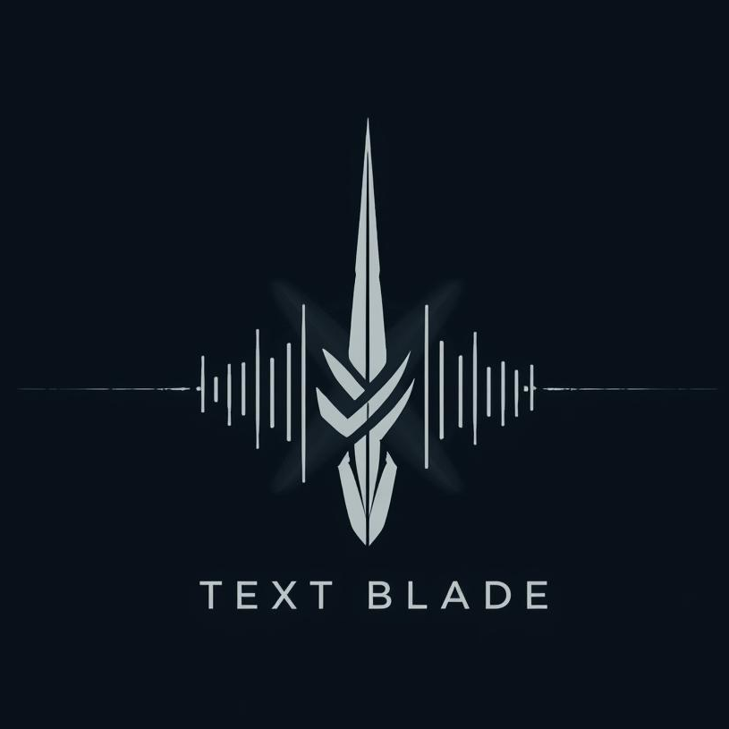

# TextBlade

[](https://github.com/blueherongames/textblade/actions/workflows/dotnet.yml)

TextBlade is an early-development text-based JRPG game maker. Some details about TextBlade:

- Create games entirely through JSON, without writing any code! Focus on game design, theme, and content!
- Customize your game by writing C# code to fit your specific requirements!
- Almost everything has audio cues! Add strong audio design to make your game really shine (and really interesting to blind players)!

If you need help, support, or would even like changes made to TextBlade, join my Discord server here: https://discord.gg/XxHNM3UuKg​​.

Anything related to Void Walkers is content for the sample game.

---

## Table of Contents

- [Quick Start](#quick-start)
- [Creating Your First Game](#creating-your-first-game)
- [Game Structure](#game-structure)
- [Content Creation Guide](#content-creation-guide)
  - [Game Configuration](#game-configuration)
  - [Characters & Party](#characters--party)
  - [Locations](#locations)
  - [Dungeons](#dungeons)
  - [Shops](#shops)
  - [NPCs & Quest Givers](#npcs--quest-givers)
  - [Items & Equipment](#items--equipment)
  - [Skills](#skills)
  - [Monsters](#monsters)
  - [Statuses](#statuses)
- [Audio System](#audio-system)
- [Game Switches](#game-switches)
- [Advanced Customization](#advanced-customization)
- [Building & Running](#building--running)

---

## Quick Start

The fastest way to get started is to look at the **VoidWalker** sample game in `source/VoidWalker.Main/`. It demonstrates all the core features of TextBlade.

To run VoidWalker:

```powershell
cd source\VoidWalker.Main
dotnet run
```

---

## Creating Your First Game

1. **Create a new .NET Console project** referencing TextBlade.Core and TextBlade.ConsoleRunner:

```xml
<ItemGroup>
  <ProjectReference Include="..\TextBlade.ConsoleRunner\TextBlade.ConsoleRunner.csproj" />
  <ProjectReference Include="..\TextBlade.Core\TextBlade.Core.csproj" />
</ItemGroup>
```

2. **Set up your Program.cs**:

```csharp
using Microsoft.Extensions.DependencyInjection;
using Microsoft.Extensions.Hosting;
using TextBlade.ConsoleRunner;
using TextBlade.Core.Game;

namespace YourGame;

internal class Program
{
    public static void Main(string[] args)
    {
        using var host = Host.CreateDefaultBuilder(args)
            .ConfigureServices((_, services) =>
            {
                services.AddTextBlade();
            })
            .Build();
        host.Services.GetRequiredService<IGame>().Run();
    }
}
```

3. **Create a Content folder** in your project directory with the following structure:

```
Content/
├── Game.json
├── Credits.txt
├── Data/
│   ├── Items.json
│   ├── Skills.json
│   ├── Monsters.json
│   └── Statuses.json
├── Locations/
│   └── YourTown/
│       └── YourTown.json
├── Dungeons/
└── Audio/
    ├── bgm/    (background music)
    ├── bgse/   (background sound effects)
    └── sfx/    (sound effects)
```

4. **Ensure Content files are copied to output** by adding this to your .csproj:

```xml
<ItemGroup>
  <Content Include="Content/**/*">
    <CopyToOutputDirectory>PreserveNewest</CopyToOutputDirectory>
  </Content>
</ItemGroup>
```

---

## Game Structure

TextBlade games are built using JSON configuration files in the `Content` folder. The engine handles all game logic, battle systems, inventory management, and progression. You just define your content!

**Core Principle**: Design your game in JSON first. Add C# code only when you need custom behavior.

---

## Content Creation Guide

### Game Configuration

Create `Content/Game.json` to configure your game:

```json
{
    "GameName": "My Awesome Game",
    "StartingLocationId": "Locations/StartingTown/StartingTown",
    "StartingParty": [
        {
            "Name": "Hero",
            "CurrentHealth": 100,
            "TotalHealth": 100,
            "CurrentSkillPoints": 50,
            "TotalSkillPoints": 50,
            "Strength": 20,
            "Toughness": 10,
            "Special": 10,
            "SpecialDefense": 10,
            "SkillsLearnedAtLevel": [
                {"Item1": "Double Strike", "Item2": 2},
                {"Item1": "Heal", "Item2": 5}
            ]
        }
    ]
}
```

**Properties:**
- `GameName`: Display name of your game
- `StartingLocationId`: Path to the initial location JSON (without .json extension)
- `StartingParty`: Array of characters with their stats and skills
- `SkillsLearnedAtLevel`: Skills learned at specific levels
  - **Note**: Yes, `Item1` and `Item2` are the actual property names! This is how .NET serializes tuples.
  - `Item1` = skill name (string)
  - `Item2` = level when learned (number)

### Characters & Party

Define your party members with these stats:

- **Health**: `CurrentHealth` and `TotalHealth`
- **Skill Points**: `CurrentSkillPoints` and `TotalSkillPoints` (used for skills/magic)
- **Strength**: Physical attack power
- **Toughness**: Physical defense
- **Special**: Magic/special attack power
- **SpecialDefense**: Magic/special defense

### Locations

Create location files in `Content/Locations/`. Example: `Content/Locations/KingsVale/KingsVale.json`

```json
{
    "Name": "King's Vale",
    "Description": "A small village ruled by King Sulayman.",
    "BackgroundAudio": "bgse/seagulls",
    "LinkedLocations": [
        {"Id": "Locations/KingsVale/Inn", "Description": "The King's Inn"},
        {"Id": "Locations/KingsVale/Shop", "Description": "The Item Shop"},
        {"Id": "Dungeons/FirstCave", "Description": "Explore the cave", "SwitchRequired": "TalkedTo_King"}
    ],
    "NPCs": [
        {
            "Name": "Villager",
            "Texts": [
                "Welcome to our village!",
                "The king is worried about monsters.",
                "Please help us!"
            ]
        }
    ]
}
```

**Properties:**
- `Name`: Location display name
- `Description`: What players see when entering
- `BackgroundAudio`: Path to audio file (relative to Content/Audio/)
- `LinkedLocations`: Exits/connections to other locations
  - `Id`: Path to destination location
  - `Description`: How the exit appears to players
  - `SwitchRequired` (optional): Game switch that must be true to show this exit
- `NPCs`: Non-player characters in this location

### Dungeons

Dungeons are special locations with random battles. Create in `Content/Dungeons/`:

```json
{
    "$type": "TextBlade.Core.Locations.Dungeon, TextBlade.Core",
    "Name": "North Seaside Cave",
    "Description": "A dark cave that smells of salt.",
    "BackgroundAudios": [
        "bgse/cave",
        "bgse/bat-wings"
    ],
    "LinkedLocations": [
        {"Id": "Locations/KingsVale/KingsVale", "Description": "Exit to King's Vale"}
    ],
    "NumFloors": 7,
    "Monsters": ["Goblin", "Spider", "Gargoyle"],
    "FloorLoot": {
        "B2": ["Iron Sword", "Potion-A"],
        "B5": ["Potion-B", "Iron Armour"]
    },
    "Boss": "Dragon King"
}
```

**Properties:**
- `$type`: Must be `"TextBlade.Core.Locations.Dungeon, TextBlade.Core"`
- `NumFloors`: Number of floors to complete
- `Monsters`: List of monster names that can appear (from Monsters.json)
- `FloorLoot`: Items found on specific floors (B1, B2, etc.)
- `Boss`: Boss monster name (appears on final floor)
- `BackgroundAudios`: Multiple audio tracks can play randomly/layered

**Automatic Switch**: Completing a dungeon sets `CompletedDungeon_{DungeonName}` (e.g., `CompletedDungeon_NorthSeasideCave`)

### Shops

#### Item Shop

```json
{
    "$type": "TextBlade.Core.Locations.ItemShop, TextBlade.Core",
    "Name": "Potions R Us",
    "Description": "A room that smells like herbs.",
    "BackgroundAudio": "bgse/bubbling",
    "LinkedLocations": [
        {"Id": "Locations/Town/Town", "Description": "Back to Town"}
    ],
    "Items": [
        "Potion-A",
        "Potion-B"
    ]
}
```

#### Equipment Shop

```json
{
    "$type": "TextBlade.Core.Locations.EquipmentShop, TextBlade.Core",
    "Name": "Bronzebeard's Wares",
    "Description": "Weapons and armor line the walls.",
    "LinkedLocations": [
        {"Id": "Locations/Town/Town", "Description": "Back to Town"}
    ],
    "Items": [
        "Iron Sword",
        "Iron Helmet",
        "Iron Armour"
    ]
}
```

#### Inn

```json
{
    "$type": "TextBlade.Core.Locations.Inn, TextBlade.Core",
    "Name": "The Cozy Inn",
    "Description": "A warm, inviting inn.",
    "LinkedLocations": [
        {"Id": "Locations/Town/Town", "Description": "Back to Town"}
    ],
    "Cost": 50
}
```

**Note**: Players can rest at inns to restore HP/SP for a cost.

### NPCs & Quest Givers

#### Regular NPC

NPCs can say multiple things. Each time you talk to them, they rotate through their texts:

```json
{
    "Name": "Helpful Man",
    "Texts": [
        "Hello there!",
        "Nice weather today.",
        "Come back anytime!"
    ]
}
```

#### Quest Giver

Quest givers have different dialogue before and after quest completion:

```json
{
    "$type": "TextBlade.Core.Characters.QuestGiver, TextBlade.Core",
    "Name": "King Sulayman",
    "Texts": [
        "Please clear the monsters from the cave!"
    ],
    "PostQuestTexts": [
        "Thank you for your service!"
    ],
    "QuestCompleteSwitchName": "CompletedDungeon_NorthSeasideCave"
}
```

**Automatic Switch**: Talking to a quest giver sets `TalkedTo_{QuestGiverName}` (e.g., `TalkedTo_KingSulayman`)

### Items & Equipment

Define items in `Content/Data/Items.json`:

#### Weapons

```json
{
    "Iron Sword": {
        "$type": "TextBlade.Core.Inv.Equipment, TextBlade.Core",
        "ItemType": "Weapon",
        "StatsModifiers": { "Strength": 7 },
        "Value": 200,
        "DamageType": "Sword"
    }
}
```

#### Armor

```json
{
    "Iron Helmet": {
        "$type": "TextBlade.Core.Inv.Equipment, TextBlade.Core",
        "ItemType": "Helmet",
        "StatsModifiers": { "Toughness": 3 },
        "Value": 100
    },
    "Iron Armour": {
        "$type": "TextBlade.Core.Inv.Equipment, TextBlade.Core",
        "ItemType": "Armour",
        "StatsModifiers": { "Toughness": 5 },
        "Value": 150
    }
}
```

#### Consumables

```json
{
    "Potion-A": {
        "$type": "TextBlade.Core.Inv.Consumable, TextBlade.Core",
        "ItemType": "Consumable",
        "Value": 25,
        "RestoreHealth": 50
    },
    "Potion-B": {
        "$type": "TextBlade.Core.Inv.Consumable, TextBlade.Core",
        "ItemType": "Consumable",
        "Value": 75,
        "RestoreHealth": 100,
        "RestoreSkillPoints": 25
    }
}
```

**Equipment Types**: Weapon, Helmet, Armour, Accessory
**Damage Types**: Sword, Fire, Ice, Poison, etc.

### Skills

Define skills in `Content/Data/Skills.json`:

```json
{
    "Double Strike": {
        "DamageMultiplier": 2.0,
        "Cost": 10
    },
    "Whirlwind": {
        "DamageMultiplier": 1.25,
        "Cost": 20,
        "Target": "AllEnemies"
    },
    "Fire A": {
        "DamageMultiplier": 1.1,
        "Cost": 7,
        "DamageType": "Fire",
        "StatusInflicted": "Burn",
        "StatusStacks": 5
    },
    "Heal": {
        "DamageMultiplier": 0,
        "Cost": 15,
        "Target": "Self",
        "HealAmount": 50
    }
}
```

**Properties:**
- `DamageMultiplier`: Multiplier for damage (0 = no damage)
- `Cost`: Skill points required
- `Target`: "Single" (default), "AllEnemies", "Self", "AllAllies"
- `DamageType`: Fire, Ice, Poison, etc.
- `StatusInflicted`: Status effect to apply
- `StatusStacks`: Number of status stacks to apply
- `HealAmount`: HP restored (for healing skills)

### Monsters

Define monsters in `Content/Data/Monsters.json`:

```json
{
    "Goblin": {
        "Health": 45,
        "Strength": 15,
        "Toughness": 3,
        "Weakness": "Sword",
        "Gold": 5,
        "ExperiencePoints": 10
    },
    "Spider": {
        "Health": 55,
        "SkillPoints": 15,
        "Strength": 15,
        "Toughness": 5,
        "Weakness": "Fire",
        "Gold": 10,
        "ExperiencePoints": 20,
        "SkillNames": [
            { "Name": "Web", "Probability": 0.3 }
        ]
    },
    "Dragon King": {
        "Health": 500,
        "SkillPoints": 200,
        "Strength": 50,
        "Toughness": 30,
        "Special": 40,
        "SpecialDefense": 35,
        "Weakness": "Ice",
        "Gold": 1000,
        "ExperiencePoints": 500,
        "SkillNames": [
            { "Name": "Fire Breath", "Probability": 0.5 }
        ]
    }
}
```

**Properties:**
- `Health`: Monster HP
- `SkillPoints`: SP for using skills (optional)
- `Strength`, `Toughness`, `Special`, `SpecialDefense`: Combat stats
- `Weakness`: Damage type this monster is weak to
- `Gold`: Money dropped on defeat
- `ExperiencePoints`: XP awarded
- `SkillNames`: Skills the monster can use with probability (0.0-1.0)

### Statuses

Define status effects in `Content/Data/Statuses.json` (poison, burn, etc.).

---

## Audio System

TextBlade supports three types of audio:

1. **Background Music (BGM)**: Place in `Content/Audio/bgm/`
2. **Background Sound Effects (BGSE)**: Place in `Content/Audio/bgse/` (ambient sounds like wind, water)
3. **Sound Effects (SFX)**: Place in `Content/Audio/sfx/` (action sounds)

**Supported Formats**: .wav, .mp3, .ogg

**Usage in JSON**:
```json
"BackgroundAudio": "bgse/seagulls"
"BackgroundAudios": ["bgse/cave", "bgse/dripping-water"]
```

Paths are relative to `Content/Audio/`.

---

## Game Switches

Game switches are boolean flags that track game state (quests completed, events triggered, etc.).

**Accessing in Code**:
```csharp
using TextBlade.Core.Game;

// Check a switch
if (GameSwitches.Switches["CompletedDungeon_FirstCave"])
{
    // Do something
}

// Set a switch
GameSwitches.Switches["CustomEvent"] = true;
```

**Automatic Switches Set by TextBlade**:
- `TalkedTo_{QuestGiverName}`: Set when talking to a quest giver
- `CompletedDungeon_{DungeonName}`: Set when clearing a dungeon

**Using Switches in JSON**:
```json
"LinkedLocations": [
    {
        "Id": "Dungeons/SecretArea",
        "Description": "Enter the secret area",
        "SwitchRequired": "CompletedDungeon_FirstCave"
    }
]
```

This exit only appears if the switch is true.

---

## Advanced Customization

### Custom Location Code

Add custom C# code to locations:

1. **Add LocationClass to JSON**:
```json
{
    "Name": "Throne Room",
    "LocationClass": "ThroneRoom",
    ...
}
```

2. **Create the C# class**:
```csharp
using TextBlade.Core.UserCode;
using TextBlade.Core.Game;

[LocationCode]
public class ThroneRoom : LocationCodeBehind
{
    public ThroneRoom()
    {
        // Custom initialization
        if (!GameSwitches.Switches.ContainsKey("EnteredThroneRoom"))
        {
            GameSwitches.Switches["EnteredThroneRoom"] = true;
            // Trigger custom event
        }
    }
}
```

The `[LocationCode]` attribute tells TextBlade to load your custom class.

---

## Building & Running

### Development

```powershell
# Build the project
dotnet build

# Run the game
dotnet run

# Watch mode (auto-rebuild on changes)
dotnet watch run
```

### Publishing

```powershell
# Publish for Windows
dotnet publish -c Release -r win-x64 --self-contained

# Publish for Linux
dotnet publish -c Release -r linux-x64 --self-contained

# Publish for macOS
dotnet publish -c Release -r osx-x64 --self-contained
```

Published games will be in `bin/Release/net8.0/{runtime}/publish/`

---

## In-Game Commands

Players can use these commands while playing:

- **look** / **l**: Examine current location
- **go [location]** / **g [location]**: Travel to a linked location
- **talk [npc]** / **t [npc]**: Talk to an NPC
- **status** / **st**: View party status
- **inventory** / **i**: View inventory
- **equip [item]**: Equip an item
- **use [item]**: Use a consumable
- **buy [item]**: Purchase from shops
- **sleep**: Rest at an inn (restores HP/SP)
- **fight**: Engage in battle (in dungeons)
- **save**: Save the game
- **credits**: View game credits
- **help** / **h**: Show help
- **quit** / **q**: Exit game

---

## Tips for Game Design

1. **Start Small**: Create one town, one dungeon, and a few monsters first
2. **Balance Progression**: Make sure monster difficulty scales with player levels
3. **Use Switches Creatively**: Lock areas behind quests, create branching storylines
4. **Audio Matters**: Good audio makes games more immersive, especially for blind players
5. **Test Frequently**: Play through your game often to catch balance issues
6. **Study VoidWalker**: The sample game demonstrates best practices

---

## Credits System

Create a `Content/Credits.txt` file to display credits when players type `credits`:

```
My Awesome Game created by [Your Name]

Special thanks to:
- [Contributor 1]
- [Contributor 2]

Audio resources:
- [Sound attribution]
- [Music attribution]
```

---

## Getting Help

- **Discord**: https://discord.gg/XxHNM3UuKg
- **Sample Game**: Check out VoidWalker in `source/VoidWalker.Main/`
- **Documentation**: See `TextBlade.md` for additional details

Happy game making! ⚔️🎮
